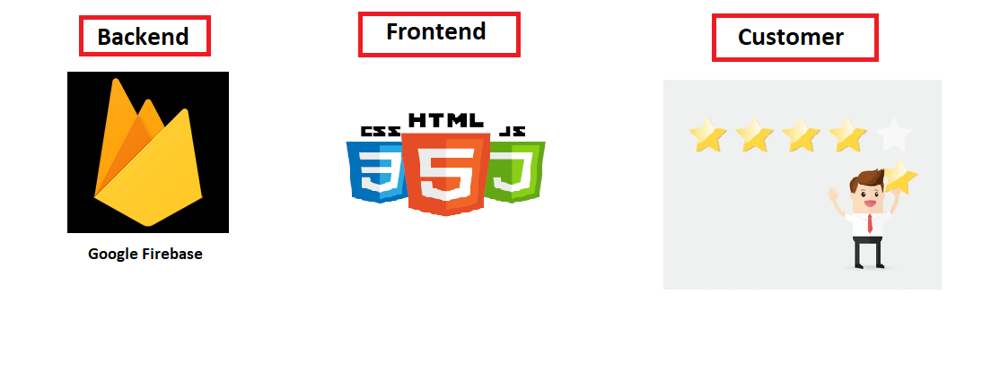
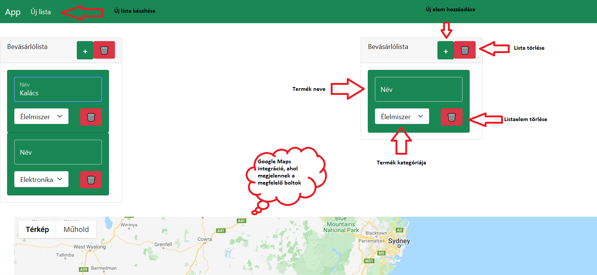

# Funkcionális specifikáció

## Jelenlegi helyzet

A jelenlegi bevásárló listákat vagy kézzel írják, vagy bonyolult alkalmazásokba veszik fel őket. 
Ezek között nincs semmilyen kapcsolat, átláthatatlan a rendszer.

Fizikai listák:
-	kézzel írott, amit sok esetben még az is nehezen olvas, aki írta
-	papír alapú, ami könnyen sérül, elhagyható és környezetszennyező

Digitális listák:
-	Drága, fizetős alkalmazások, reklámok
-	A különböző eszközökről nem lehet elérni ugyanazt a listát
-	Bonyolult felhasználó felület

## Vágyálom rendszer leírása

A startup-unk célja egy olyan webalkalmazás elkészítése, melyben a felhasználónak lehetősége van létrehoznia a saját bevásárlólistáját. Erre a listára a felhasználó tetszőleges tételeket vihet fel, melyeknek a kategóriáját is megadhatja (pl. élelmiszer, tisztítószer stb.). Továbbá a felhasználónak lehetősége van *kihúzni* tételeket a listából, illetve *lezárni/törölni* egész listákat is. Az alkalmazás különlegessé az, hogy mindemellett a felhasználó egy térképen láthatja a közelében lévő boltokat, ahonnan az adott terméket megvásárolhatja, akár útvonalat is tervezhet hozzájuk. 

Az alkalmazás tervezésekor különös figyelmet szentelünk az igényes felhasználói felület megalkotására, a könnyű és intuitív használatra, valamint a praktikusságra.

## Követelménylista

 |  ID |  Név  | Kifejtés |
|:-----:|:-----:|:---------:|
| K1  | Bevásárlólista | A felhasználó tudjon akár több bevásárlólistát létrehozni, törölni, módosítani.|
| K2 | Listaelem | Lehetőséget kell biztosítani a felhasználónak, hogy valamennyi elemet rögzíteni tudjon az adott bevásárlólistán. Ezeknek nevet, kategóriát tudjon beállítani, kihúzni |
| K3 | Térkép | Interaktív térképen megjeleníthető legyen egy adott bevásárlólista elemei hol kaphatók. Az üzletek kijelölése a listaelem kategória alapján történjen. |
| K4 | Térkép paraméterezése | A felhasználó beállíthatja milyen távolságra lévő boltokat keres. Továbbá nyitvatartás és árkategória szerint szűrheti azokat. |
| K5 | Helymeghatározás | A térkép helymeghatározást csak a felhasználó beleegyezésével alkalmazhat. Ezeket az adatokat nem tárolhatja az alkalmazás. |
| K6 | Webböngésző támogatás | Az alkalmazásnak megfelelően kell működnie a legnépszerűbb modern webböngészőkben |

## Használati esetek
~~TODO~~	

## Képernyő tervek
- **Technology Stack**

- **POC UI**
